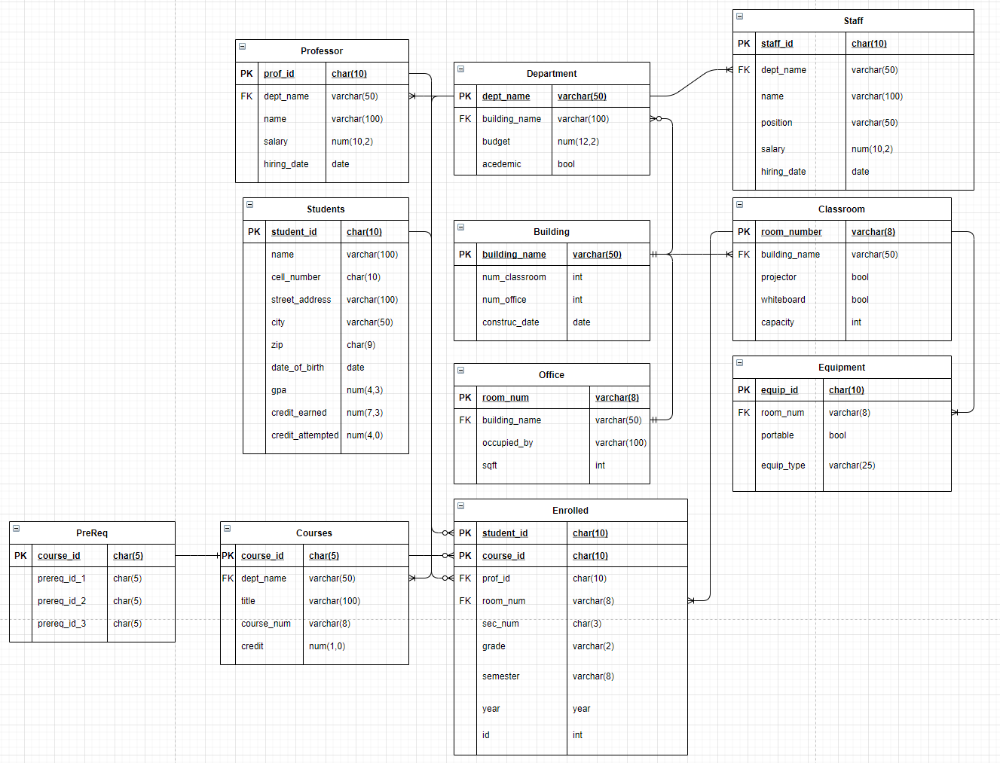

# Alec Knutson

Welcome to my website! Here I host my current works and projects. There may be object oriented code, statistical software anaylsis using programs like R and Stata, and some Research Projects.

### About me
Currently, I am enrolled at the University of Texas at Dallas in the MS Economics Program.  In the spring of 2020, I graduated from UTD with a BS in Mathematics with a specalization in Statistics and an Economics minor.  Beyond just school, I enjoy playing guitar and strategizing over board games.

I am currently seeking out an Internship for the Summer of 2021 in Data Anaylitics.

## Resume
[Alec's Current Resume](Alec's Resume 2021 (Sept) - DS.pdf)

## Projects
More to come!

###April 2021
Below you will find a small excerpt from my final paper (full paper linked [here](alecknutson_finalproject (Info Managment Spring 2021.pdf))) as well as a scheme for a database that I designed, implemented, and ingested data to in Postgres.

"I have chosen to create a University database for my final project.  It consists of eleven relations in order to track University required information.  In general, this information includes students, classes, staff, and capital that the university owns.  In order to keep everything organized, I used a relational database model when designing the schema, shown below.  This paper is broken up into four parts.  First, I will discuss the database design.  Second, I will briefly mention the data that is housed in each relation.  Next, I will discuss the front-end design that I was able to implement.  Lastly, we will discuss how the limitations of this database and how this project could be improved upon in the future.

